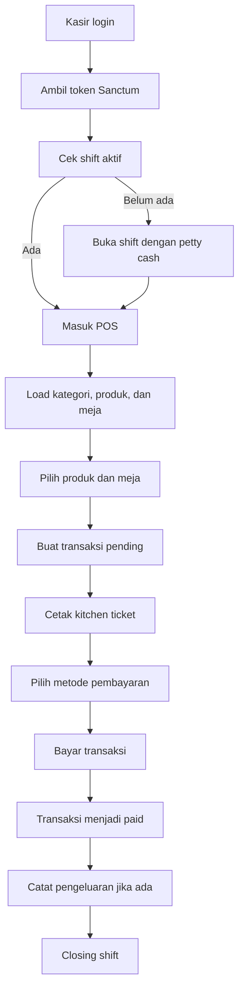
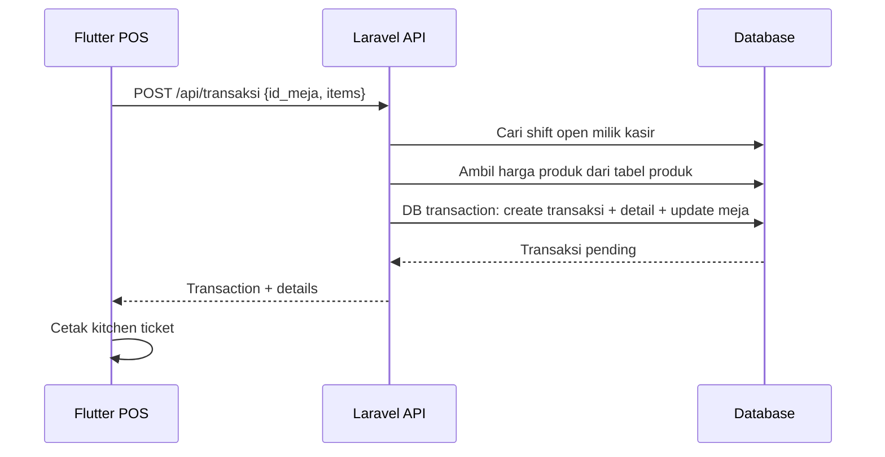
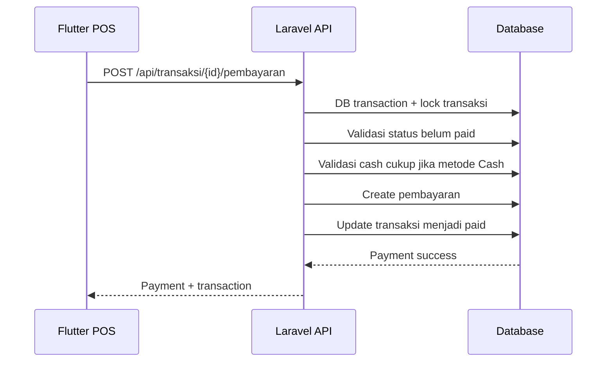
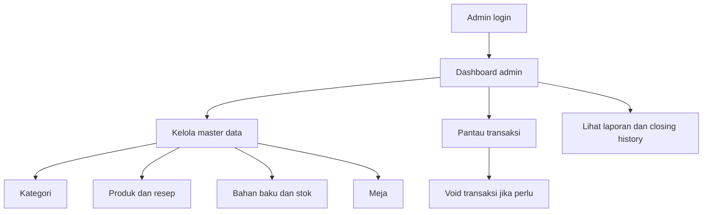

# SUSHIMOO POS - Application Workflow

Dokumen ini menjelaskan workflow operasional aplikasi berdasarkan implementasi Laravel API dan Flutter POS saat ini.

## 1. Aktor dan Hak Akses

| Aktor | Fokus kerja | Akses utama |
|---|---|---|
| Admin | Master data, monitoring, void transaksi, laporan | Dashboard admin, kategori, produk, bahan baku, stok, meja, riwayat shift, transaksi, closing, laporan |
| Kasir | Operasional outlet harian | Login, buka shift, POS, pembayaran, pengeluaran, closing shift, laporan harian |

Semua endpoint selain `POST /login` memakai `auth:sanctum`. Role dijaga oleh middleware `role:`.

## 2. Workflow Harian Kasir



### Detail aturan

- Kasir harus punya shift `open` sebelum membuat transaksi.
- Saat transaksi dibuat, meja berubah menjadi `occupied`.
- Client hanya mengirim `id_produk`, `qty`, dan `catatan`; harga selalu dihitung ulang dari database.
- Transaksi baru berstatus `pending`.
- Transaksi `paid` tidak boleh diubah.
- Pembayaran cash ditolak jika `uang_diterima` kurang dari total transaksi.
- Setiap transaksi hanya boleh memiliki satu pembayaran.

## 3. Workflow Transaksi



Payload transaksi:

```json
{
  "id_meja": 1,
  "items": [
    {
      "id_produk": 10,
      "qty": 2,
      "catatan": "Tanpa wasabi"
    }
  ]
}
```

Field `harga` tidak dipakai dari client untuk mencegah manipulasi total.

## 4. Workflow Pembayaran



| Kondisi | Hasil |
|---|---|
| Transaksi sudah `paid` | Ditolak |
| Cash kurang dari total | Ditolak |
| Payment kedua untuk transaksi sama | Ditolak oleh unique index `pembayaran.id_transaksi` |
| Non-cash tanpa `uang_diterima` | Dianggap sebesar total transaksi |

## 5. Workflow Admin



### Detail aturan

- Admin bisa melihat daftar semua transaksi.
- Admin bisa void transaksi.
- Void transaksi mengubah status menjadi `cancelled` dan mengembalikan meja menjadi `available`.
- Admin mengakses laporan bulanan, statistik, riwayat shift, dan riwayat closing.

## 6. Status Data Utama

### Transaksi

| Status | Arti | Transisi |
|---|---|---|
| `pending` | Order dibuat, belum dibayar | Bisa menjadi `paid` atau `cancelled` |
| `paid` | Order sudah dibayar | Tidak boleh di-update |
| `cancelled` | Order dibatalkan oleh Admin | Final |

### Meja

| Status | Arti | Diubah saat |
|---|---|---|
| `available` | Meja kosong | Awal / void |
| `occupied` | Ada transaksi pending/aktif | Transaksi dibuat |

### Shift

| Status | Arti |
|---|---|
| `open` | Kasir sedang bertugas |
| `closed` | Shift sudah selesai dan siap closing/report |

## 7. Checklist QA Manual

1. Login sebagai Kasir.
2. Buka shift.
3. Buat transaksi dengan item valid tanpa mengirim `harga`.
4. Pastikan total mengikuti harga produk di database.
5. Coba bayar cash dengan nominal kurang dari total, harus gagal.
6. Bayar cash dengan nominal cukup, harus sukses dan ada kembalian.
7. Coba bayar transaksi yang sama lagi, harus gagal.
8. Coba update transaksi yang sudah `paid`, harus gagal.
9. Login sebagai Admin.
10. Void transaksi pending dan pastikan meja kembali `available`.
11. Cek laporan harian/bulanan.

## 8. Catatan Implementasi

- Backend memakai pola `Controller -> Service -> Repository -> Model`.
- Logika bisnis transaksi dan pembayaran berada di service.
- Operasi kritis transaksi dan pembayaran memakai database transaction.
- Payment memakai row lock saat mengubah status transaksi untuk mengurangi risiko double payment.
- Migration `2026_07_12_000001_add_unique_transaction_to_pembayaran_table.php` memastikan satu transaksi hanya punya satu pembayaran.
